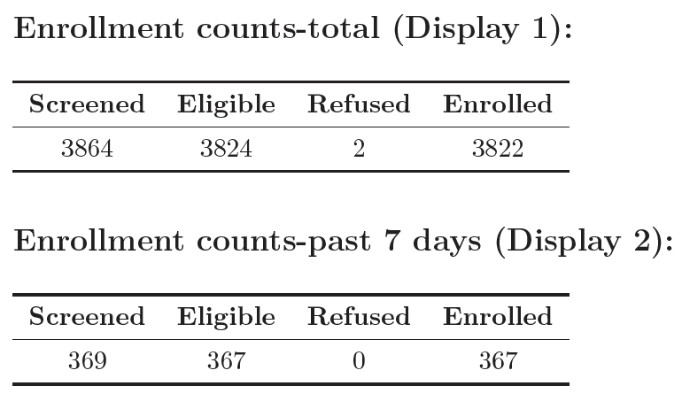

# Building Automated Markdown Reports

"Never forget Murphy's Law 2.0: Anything that can't go wrong, will go wrong." -T. Porco

_Contributors: Will Godwin, Ying Lin, Ben Arnold_

Many teams at Proctor conduct trials that utilize electronic data collection, with data flowing in daily. In order to identify potential errors in the field, we have found it very valuable to download, process, and visualize the data on a weekly and daily basis. On numerous occassions, Thanks to monitoring reports, we have been able to identify and rectify impossibly tall 3-month olds or a toddler with different birthdates on separate interviews. Proactively identifying preventable error saves hassle when processing the final data and ultimately makes trials more accurate and efficient. We visualize the data using reports of tables and figures generated in R markdown. This document provides a template for building your own R markdown report, whether for DSMC meeting or internal use. I've also included an [example script](templates/example_report.Rmd) to show how a report can look in practice.

$~$

## Setting up the markdown
### YAML
The YAML is the opening header to most R markdown documents and allows the user to specify parameters regarding the layout and output of the document. Among other things, here is where you can add a table of contents, a subtitle, or specify the default output to be pdf file. For a monitoring report, the YAML might look as follows:

```
---
title: "EXAMPLE Weekly Report"
subtitle:
- <h1><u>CONFIDENTIAL-DO NOT DISSEMINATE</u></h1>
author: "Will Godwin"
date: "`r format(Sys.time(), '%d %B %Y')`"
output:
  pdf_document:
    toc: true
    toc_depth: 2
---
```

$~$

### Directory structure
Your report may begin as a couple files in a folder but as it grows in size and complexity, I highly recommend systematizing and standardizing the process for posterity and your own sanity. Refer to [chapter 3](directory-structure-and-code-repositories.html) for guidance on building a standardized directory structure and [chapter 4](codingpractices.html) for information on coding practices and utilizing the *here* package, which I use throughout the process.

$~$

## Automating the data export process
Creating a system that enables you to run some code and download new data in a systematic manner, as opposed to manually downloading the data, is critical to saving time and headaches down the road. This is especially important if you're building a report that will be run weekly or daily. It may require a little more work on the front end but programmatically downloading data rather than manually will likely be faster, better documented, and standardized. If you work on a team that uses the World Bank's *Survey Solutions* for data collection and storage, there is a great API tool that allows you to export data directly from the project's server. Example code for that process can be found [here](templates/api_example.R). Salesforce, REDCap, and other electronic data capture systems likely have a similar functionality that other Proctor researchers may be more familiar with.

$~$

## Loading the data
Depending on the nature of the trial, there may be multiple files to load after exporting the data. I would suggest using a table (ie simple .csv file) to track all necessary files for the report, as shown below. Refer to the [example script](templates/read_clean_data_example.R) for how this looks in a setting that utilizes *Survey Solutions*.

<center>
```{r rep-fig1, echo=FALSE, message=F, out.width='60%', out.height='40%'}
library(here)
#setwd("/Users/williamgodwin/Box Sync/Burkina Faso/Will/dcc_chap")
knitr::include_graphics(here("images/report-images", "api_meta.png"))
```
</center>

$~$

## Data cleaning/processing
I won't focus explicitly on data cleaning and processing since this process is usually fairly project specific. Briefly, after reading data into R, spend some time making sure all relevant variables (columns) were loaded and checking that variable classes are encoded as expected. Below is an example that checks the structure of the data and converts all variables that should be "Date" class to be so.

```
#convert all variables with "date" within the name to date class
dt.anthro %<>% mutate_at(vars(matches("date")), as.Date)

#convert all values within "childID" variable to lowercase
dt.anthro %<>% mutate_at(vars(matches("childID")), tolower)
```

$~$

## Data monitoring

Now that we have data read into R and structured appropriately, we can focus on the (2) primary aims of the report: data validation to be used internally and DSMC-style presentation of the data. Of course the aims of your report may vary but the monitoring examples below represent evaluations critical to almost any RCT.

### Data validation

#### Missing/inappropriately structured data
While not the most glamorous component of the report, checking for missing data is critical. It's helpful once all the data have been read in, to conduct some important checks of the data integrity. Did R (or python, etc) correctly interpret and load the data files? Are there any participant IDs missing? Are there participant's with reported birthdates in the future? This is an important stage to think about the plethora of maladies that could befall the data in between when it was recorded and when it got to you. Below are examples of how you could check for some common issues.

```{r, echo=F}
na_childSex <- 4
```
```
#check for missing values across all columns
map(dt.anthro, ~sum(is.na(.)))

#check for missing values in childsex
na_childSex <- sum(is.na(dt.anthro$childSex))

There are `r na_childSex` rows with missing values for child sex.
```

$~$

#### Reporting inconsistencies
Many studies may use multiple independent questionnaires to gather information at different timepoints and ask the same demographic information. For example, in an individually randomized trial, each participant receives an ID that links the participant responses across all timepoints of the study. Below is an example showing how to check that the responses are consistent across all questionnaires.

```
#join anthro and swabs data by childID to check where childSex is different
dt.anthro %>%
  select(childSex, childID) %>%
  inner_join(
    dt.swabs %>% select(childSex, childID),
    by="childID"
  ) %>%
  filter(childSex.x!=childSex.y)
```

Another component of data validation is checking for overt errors and outliers, many of which can often be fixed in the field. One example is when interviewers may accidentally record a study participant's weight in kilograms instead of grams, resulting in an error 3 magnitudes in size. This error is easily identified (red circle) from plotting the distribution of the birthweights in a histogram.

```
#age histogram
dt.anthro %>%
  mutate(weeks = difftime(startTime, date_of_birth, units = "weeks")) %>%
  ggplot(dt.anthro, aes(weeks)) +
    geom_histogram(binwidth = .2) +
    theme_bw() +
    xlab("Age (weeks)") +
    ylab("Count")
```
<center>
```{r rep-fig2, echo=FALSE, out.width='60%', out.height='40%', align="center"}
knitr::include_graphics(here("images/report-images","birthweight.png"))
```

Distribution of participant birthweights in grams
</center>

$~$

### Data presentation (DSMC-style)
The ultimate arbiter of whether a trial remains running is often the Data and Safety Monitoring Committee (DSMC) and these reports can be used to present preliminary findings/analyses as well as detail all relevant safety metrics.

#### Enrollment
Any study investigator cares a lot about enrollment, since it determines the length and cost of the trial, among other things. Therefore, any report needs tables/figures showing enrollment trends and trajectory. Below are a couple examples of what they can look like.
<!--  -->

<center>
```{r rep-fig3, echo=FALSE, out.width='50%', out.height='30%'}
knitr::include_graphics(here("images/report-images","enrollment1.png"))
```

```{r rep-fig4, echo=FALSE, out.width='70%', out.height='50%'}
knitr::include_graphics(here("images/report-images","enrollment2.png"))
```

Enrollment counts across the length of the study period.
</center>

$~$

#### Baseline characteristics
Demographic characteristics of the enrolled participants at baseline are often necessary.
<center>
```{r rep-fig5, echo=FALSE, out.width='60%', out.height='40%'}
knitr::include_graphics(here("images/report-images","baseline.png"))
```
</center>
$~$

#### Treatment
There is usually a treatment component to an RCT, where participants are treated according to their assigned arm (i.e. treatment or placebo). The report should include checks that confirm particpants actually received the treatment that they were randomized to. Otherwise, the results of the study lack interpretability and are likely null.

```
#merge with treatment letters
wrong_random <- dt.treatment %>%
  left_join(dt_letters, by="childID") %>%
  #the treatment letter does not match what's in database
  tally(TL != assignment) %>% as.numeric()

Number of IDs where treatment letter given does not match database: 0
```
<center>
```{r rep-fig7, echo=FALSE, out.width='40%', out.height='20%'}
knitr::include_graphics(here("images/report-images","treatment.png"))
```

Counts of number treated and number eligible, along with percent treated (coverage), by region.
</center>

$~$

#### Primary/secondary outcomes (***masked!***)
This is probably the most exciting section for an investigator to see since these metrics are the motivation of the trial itself. Be especially vigilient to make sure that the figures remain masked when sending to trial investigators and coordinators. This means making sure that you send no information regarding the treatment assignments while the trial is still active.

<center>
```{r rep-fig8, echo=FALSE, out.width='50%', out.height='35%'}
knitr::include_graphics(here("images/report-images","primary_outcome.png"))
```

Preliminary mortality rate and total person-years by region.

$~$

```{r rep-fig9, echo=FALSE, out.width='50%', out.height='40%'}
knitr::include_graphics(here("images/report-images","growth_curves.png"))
```

Height growth curves of participants at Baseline and 6-month timepoints. 
</center>

$~$

#### Follow-up/Adverse events
This report can serve as guard against loss to follow-up, an issue that plagues many trials. By actively monitoring the number of participants that have, and have not, been followed-up on, we can communicate where participants or clusters need to more attention to workers in the field. Below is an example showing follow-up percentages by region.

<center>
```{r rep-fig10, echo=FALSE, out.width='50%', out.height='35%'}
knitr::include_graphics(here("images/report-images","followup.png"))
```
</center>

As mentioned above, adverse events should be tabulated and closely watched throughout the study to monitor if the intervention may be causing increased harm.

<center>
```{r rep-fig11, echo=FALSE, out.width='65%', out.height='45%'}
knitr::include_graphics(here("images/report-images","adverse_events.png"))
```
</center>

$~$

### Appendix (if necessary)
Sometimes an appendix can be helpful to display long lists or addendums to tables shown earlier in the report. Below is an example of a list enumerating all adverse events that were not included in the AE table within the main report.

<center>
```{r rep-fig12, echo=FALSE, out.width='70%', out.height='50%'}
knitr::include_graphics(here("images/report-images","appendix.png"))
```
</center>

$~$

## Summary
This chapter described and illustrated an example of a data monitoring report using R markdown. This is, by no means, an exhaustive list of what to include in a monitoring report but meant to serve as a template as you create your own report. It is specifically geared towards continuous monitoring of randomized-controlled trials but the overarching concepts apply to other types of trials or even retrospective analyses.